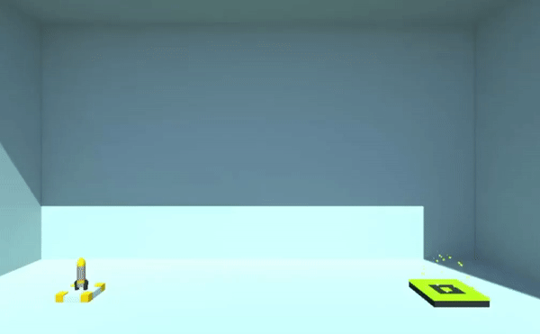
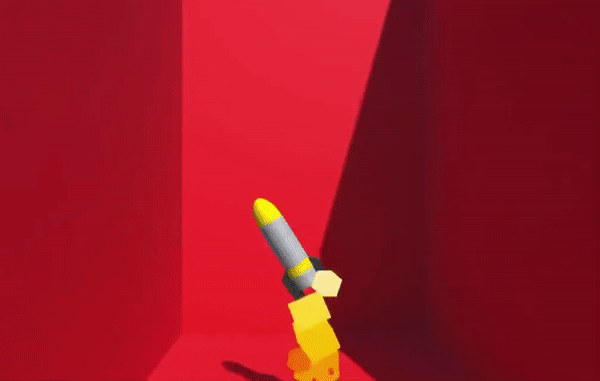

# Rocket Training Simulator
Complete your rocket training and launch your first rocket into space. Go fast and furious if you have the skills, but slow and steady wins the race. Rocket Training Simulator is a game that was made with Unity using C#. It was then build into WebGL player and uploaded onto itch.io.

Control:
- A – Rotate Left
- D- Rotate Right
- Space – Thrust

Try it out:

http://www.catcodebox.com/rocket-training-program/
